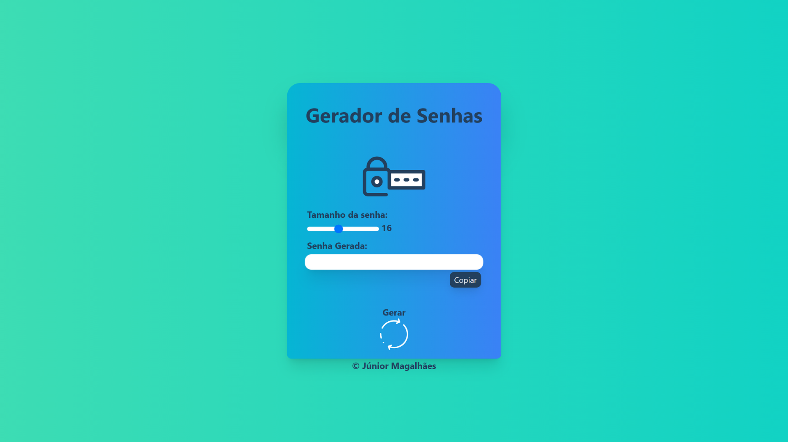

<h1 align="center">
  Gerador de Senhas
</h1>

  

## 🚀 Tecnologias

Esse projeto foi desenvolvido com as seguintes tecnologias:

- Tailwind CSS
- JavaScript

## 💻 Projeto

- O projeto gera senhas aleatórias com um comprimento variável, podendo variar de 4 a 32 caracteres.
- Projeto Responsivo.

- [Acesse o projeto finalizado, online](https://gerador-de-senhas22.web.app/)

## :memo: Licença

Esse projeto está sob a licença Júnior Magalhães.

---

Feito por by Júnior Magalhães 
